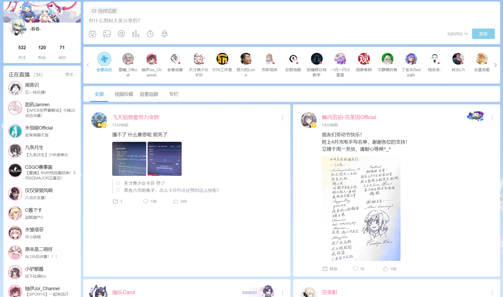

# A-SOUL辅助插件

## 概述

本插件致力于为AU提供在B站网页版（暂时）的使用体验。

## 功能

> 已选项为已完成

- [x] A-SOUL成员直播间开播提醒

- [ ] B站主页
  - [ ] 主页自定义分区（默认A-soul）（尚未迁移）
  - [ ] 主页布局优化（隐藏主页左侧推荐，将推荐视频统一拓展为展示10个）
  
  
  
- [x] 动态首页（由于B站正在更新动态首页UI，该部分可能重做）
  - [x] 动态首页左侧直播栏显示所有正在直播的up（B站默认显示10个）（迁移完成）
  
  
  
  - [x] 动态首页动态展示优化（双列）（迁移完成）
  
  
  
- [ ] 视频（1day）
  - [x] 默认开启洗脑循环
  - [ ] 默认视频清晰度
  - [ ] 可以导出视频封面（复制到剪贴板API完成）
  - [x] 默认宽屏模式
  - [x] 快速生成视频（诈骗）短链接
  
  
  
  - [ ] 评论区小作文快速查重（API已完成）
  
- [ ] 直播
  - [ ] 独轮车功能（暂时不做）
    - [ ] 定时或重复发送
    - [ ] 快捷发送（支持自定义快捷发送内容）
  
- [ ] 个人主页（1day）
  - [ ] 查成分
    - [ ] 查询是否已关注A-soul
    - [ ] 查询A-soul粉丝牌情况
    - [ ] 查询共同关注
  
- [ ] 插件popup页面（1day）
  - [ ] 显示A-soul直播情况
  - [ ] 显示A-soul近期更新的视频
  - [ ] 显示A-soul各项数据（如粉丝数，有多少天没更新等）
  
- [ ] 抖音功能
  - [ ] 添加下载视频按钮